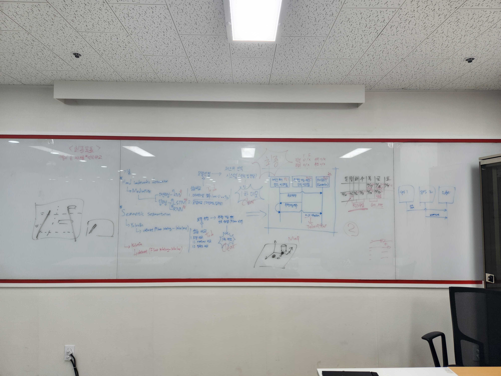

# Human-Robot Interaction System with ROS2
-

## 진행 상황

## 시스템 구성
-

## 팀원 소개 및 역할
-

## 프로젝트 기간
2023.11.25 ~ 2023.12.14

## 기술 스택
### 개발환경
-

### 언어
-

### 커뮤니케이션
-

## 프로젝트 소개
### Human-Robot Interaction System with ROS2
- mediapipe를 통해 사람의 제스처(손, 몸) 인식
- segmentation을 통해 라인 인식 및 명령 수행 여부 판단

## Hand landmarks detection
### Mediapipe
머신러닝
- KNN 
딥러닝
- LSTM
- RNN 

## Semantic segmentation 
- Yolov5
- Yolov8

## How to run?
-

## Demo video
-

## Reference
-
-
