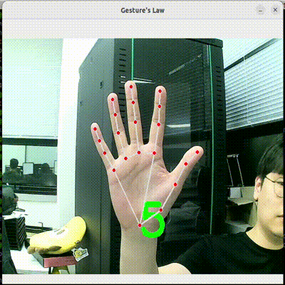

# Test space

This is a test space for technical review.

## gesture_law.py

- How to run?
```
python3 gesture_law.py
```


## pose_estimation_hands_to_keyboard.py

- How to run?
```
python3 pose_estimation_hands_to_keyboard.py
```


## pose_estimation_body_to_keyboard.py

- How to run?
```
python3 pose_estimation_body_to_keyboard.py
```


